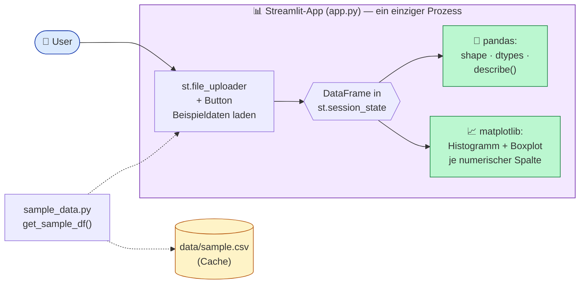

# POC 1 — CSV Explorer (Single-File Streamlit)

> **Komplexitätsstufe 1 — Single-File-App.** Eine vollständige Datenanalyse-UI
> in einer einzigen Python-Datei. Kein Backend, keine Datenbank, kein API-Layer
> — nur Streamlit + pandas + matplotlib.

Das ist die kleinste sinnvolle „Daten-App" und gleichzeitig die schnellste
Möglichkeit, eine CSV explorativ anzuschauen, ohne Notebook zu öffnen.

---

## Was die App kann

- **Zwei Datenquellen**
  - Upload einer eigenen CSV-Datei (`st.file_uploader`)
  - Button **„Beispieldaten laden"** — nutzt einen eingebauten Demo-Datensatz
    (~500 Zeilen, gemischt numerisch/kategorisch, mit absichtlich fehlenden
    Werten)
- **Vier Analyse-Blöcke**
  1. Zeilen- und Spaltenanzahl + Datenvorschau
  2. Datentypen und fehlende Werte je Spalte (absolut + Prozent)
  3. `df.describe()` als Tabelle
  4. Histogramm und Boxplot je numerischer Spalte (matplotlib)

---

## Architektur



**Datenfluss:** Eine einzige `app.py` hält UI, Datenladen, Statistik und
Plotting in einem Prozess. Der DataFrame lebt in `st.session_state`, sodass
das Auswechseln der Datenquelle die Analyse zurücksetzt.

---

## Komponenten-Walk-through

| Datei                       | Rolle                                                                                              |
| --------------------------- | -------------------------------------------------------------------------------------------------- |
| [`app.py`](app.py)          | Komplette Streamlit-App — UI, Datenladen, Statistik, Plots.                                        |
| [`sample_data.py`](sample_data.py) | Generiert via numpy/pandas einen realistischen Demo-Datensatz und cached ihn als CSV.       |
| [`data/sample.csv`](data/sample.csv) | Wird beim ersten Aufruf von `get_sample_df()` automatisch erzeugt.                          |
| [`requirements.txt`](requirements.txt) | streamlit · pandas · numpy · matplotlib.                                                  |

---

## Setup

```bash
cd POC1
python -m venv .venv
source .venv/bin/activate
pip install -r requirements.txt
```

## Starten

```bash
streamlit run app.py
```

Standard-URL: <http://localhost:8501>

Beispieldaten ohne App vorab erzeugen (optional):

```bash
python sample_data.py
```

---

## Testplan & erwartetes Verhalten

| Schritt | Aktion                                            | Erwartetes Verhalten                                                                |
| ------- | ------------------------------------------------- | ------------------------------------------------------------------------------------ |
| 1       | App starten, Browser öffnen                       | Titel **„📊 CSV Explorer"** und Hinweis auf Datenquelle.                             |
| 2       | Klick auf **„Beispieldaten laden"**               | Erfolgsmeldung *„Quelle: Beispieldatensatz"*.                                        |
| 3       | Abschnitt **1. Übersicht**                        | Zwei Metriken: Zeilen ≈ 500, Spalten ≈ 6. Ausklappbare Vorschau der ersten 20 Zeilen.|
| 4       | Abschnitt **2. Datentypen & fehlende Werte**      | Tabelle mit `dtype`, `missing`, `missing_%`. Einige Spalten zeigen NaN-Anteile > 0. |
| 5       | Abschnitt **3. describe()**                       | `count`, `mean`, `std`, `min`, `25%`, `50%`, `75%`, `max` für numerische Spalten.   |
| 6       | Abschnitt **4. Verteilungen**                     | Pro numerischer Spalte ein Histogramm und ein horizontaler Boxplot nebeneinander.   |
| 7       | Eigene CSV per **„Eigene CSV hochladen"** wählen  | Anzeige aktualisiert sich, Erfolg: *„Quelle: Upload: <dateiname>"*.                  |

---

## 📋 Der exakte Copilot-Prompt

> Diesen Prompt im Copilot Agent Mode in einen leeren Ordner pasten:

```text
Erstelle eine einfache Streamlit-App app.py mit zwei Datenquellen:
(a) st.file_uploader für eine eigene CSV,
(b) Button "Beispieldaten laden", der einen integrierten Demo-Datensatz
ohne Upload nutzt.

Erzeuge dazu ein Hilfsmodul sample_data.py mit einer Funktion
get_sample_df(), die per numpy/pandas einen realistischen Beispieldatensatz
(ca. 500 Zeilen, gemischt numerisch/kategorisch, mit einigen fehlenden
Werten) erzeugt; speichere ihn zusätzlich einmalig als data/sample.csv.

Zeige nach Auswahl der Quelle:
(1) Zeilen-/Spaltenanzahl,
(2) Datentypen und fehlende Werte je Spalte,
(3) df.describe() als Tabelle,
(4) für jede numerische Spalte Histogramm und Boxplot mit matplotlib.

Lege auch requirements.txt (streamlit, pandas, numpy, matplotlib),
.gitignore und ein kurzes README an.
```

---

## Extension Ideas

- 🔄 **Plotly statt matplotlib** für interaktive Charts (Hover, Zoom, Filter).
- 🔍 **Spaltenfilter** in der Sidebar, um nur ausgewählte Spalten zu analysieren.
- 🎯 **Outlier-Detection** (IQR oder Z-Score) als 5. Block hinzufügen.
- 📦 **Mehrere Dateien** zugleich akzeptieren und vergleichen.
- 🧪 **Datenqualitäts-Score** (Anteil komplett befüllter Zeilen, Anteil
  numerischer Spalten etc.) als Header-Metrik.
- 🚀 Schritt zu **POC2**: dieselben Analysen über ein FastAPI-Backend, damit
  Ergebnisse persistent werden — siehe [`../POC2/README.md`](../POC2/README.md).

---

## Projektstruktur

```text
POC1/
├── README.md           ← ihr seid hier
├── app.py              ← Streamlit-App
├── sample_data.py      ← get_sample_df() + cached CSV
├── data/
│   └── sample.csv      ← wird beim ersten Lauf erzeugt
└── requirements.txt
```
