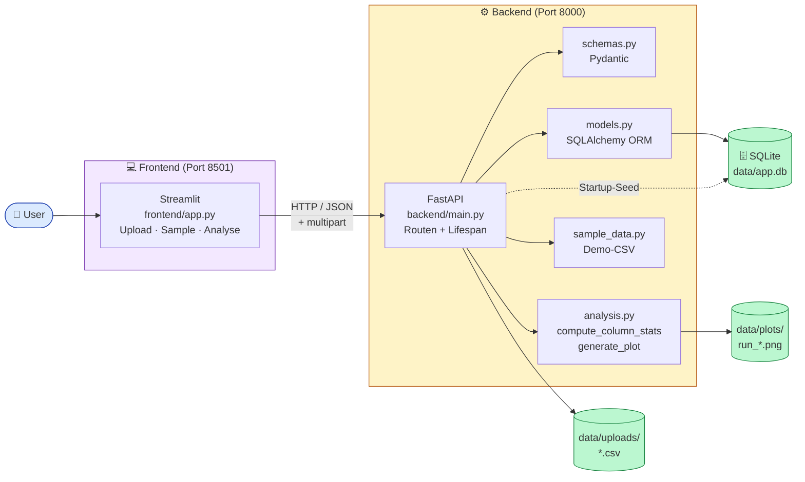
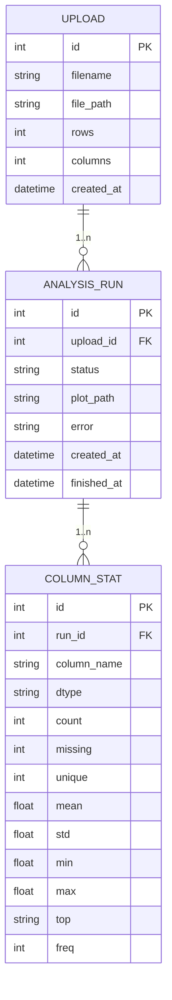
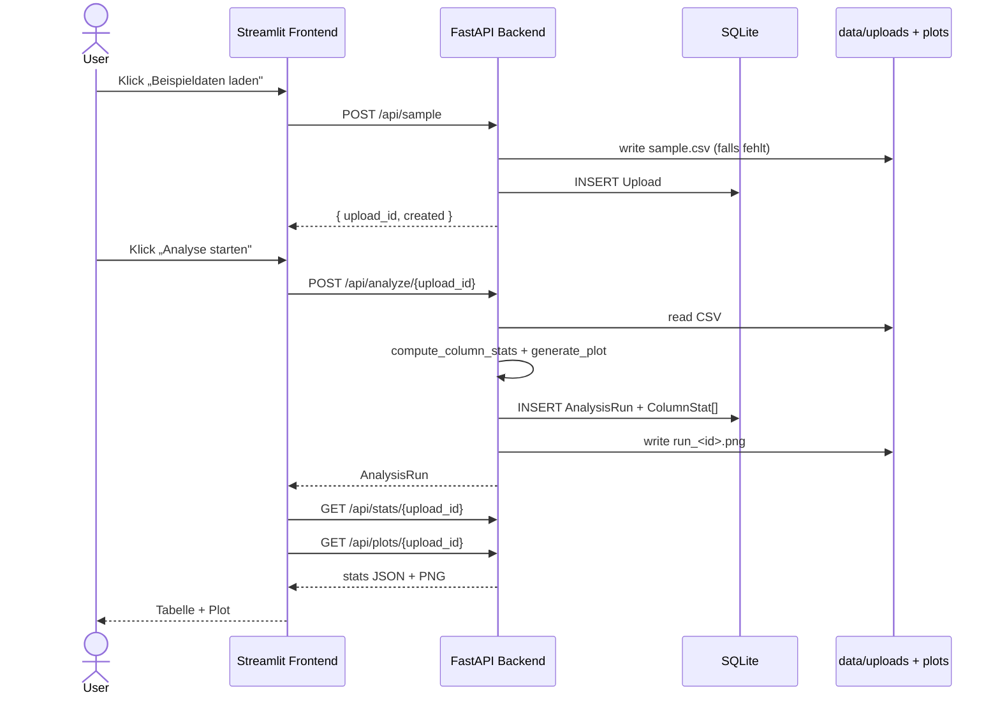

# POC 2 — Analytics Backend + Frontend

[](https://www.python.org/)
[](https://streamlit.io/)
[](https://fastapi.tiangolo.com/)
[](https://www.uvicorn.org/)
[](https://www.sqlalchemy.org/)
[](https://www.sqlite.org/)
[](https://docs.pydantic.dev/)
[](https://pandas.pydata.org/)
[](https://matplotlib.org/)
[](#architektur)
[](#)
[](../LICENSE)

> **Komplexitätsstufe 2 — Client / Server.** Dieselbe Idee wie POC 1
> (CSV explorieren), aber sauber in **Frontend, Backend und Datenbank** geteilt.
> Uploads, Analyse-Runs und Spalten-Statistiken werden persistent gespeichert.

Das ist die typische **Drei-Schichten-Architektur** moderner Web-Apps —
Streamlit als Client, FastAPI als API, SQLite als Datenhaltung — auf das
absolute Minimum reduziert.

---

## Was die App kann

- **Upload** beliebiger CSV/TSV-Dateien (Streamlit) → speichert sie auf der
  Platte und legt einen `Upload`-Eintrag in SQLite an.
- **Beispieldaten-Button** ruft `POST /api/sample` und legt (oder lädt) einen
  Demo-Upload mit ~500 Zeilen.
- **Analyse-Run** pro Upload: berechnet je Spalte `count`, `missing`, `unique`,
  `mean/std/min/max` (numerisch) bzw. `top/freq` (kategorisch) und rendert
  einen Übersichts-Plot (PNG).
- **Persistenz**: `Upload`, `AnalysisRun`, `ColumnStat` als SQLAlchemy-Modelle.
- **REST-API** mit OpenAPI-Doku unter <http://localhost:8000/docs>.

---

## Architektur



**CORS:** Backend erlaubt `http://localhost:8501` als Origin, damit das
Streamlit-Frontend Requests stellen darf.

---

## Datenmodell



### Eine Anfrage von oben nach unten



---

## API-Endpunkte

| Methode | Pfad                       | Beschreibung                                                  |
| ------- | -------------------------- | ------------------------------------------------------------- |
| `GET`   | `/api/health`              | Liveness-Check (`{"status": "ok"}`).                          |
| `POST`  | `/api/upload`              | Multipart-Upload einer CSV/TSV-Datei.                         |
| `GET`   | `/api/uploads`             | Liste aller Uploads (neueste zuerst).                         |
| `POST`  | `/api/sample`              | Legt den Beispiel-Upload an (oder gibt den bestehenden zurück) und liefert die `upload_id`. |
| `POST`  | `/api/analyze/{upload_id}` | Startet einen Analyse-Run (Stats + Plot).                     |
| `GET`   | `/api/stats/{upload_id}`   | Letzte abgeschlossene Spalten-Statistiken für einen Upload.   |
| `GET`   | `/api/plots/{upload_id}`   | Letztes gerendertes Übersichts-PNG für einen Upload.          |

Vollständige interaktive Doku via FastAPI/Swagger: <http://localhost:8000/docs>

---

## Komponenten-Walk-through

| Datei                                         | Rolle                                                                                  |
| --------------------------------------------- | -------------------------------------------------------------------------------------- |
| [`backend/main.py`](backend/main.py)          | FastAPI-App, alle Routen, Startup-Seed des Demo-Uploads, CORS-Config.                  |
| [`backend/models.py`](backend/models.py)      | SQLAlchemy-ORM: `Upload`, `AnalysisRun`, `ColumnStat`.                                  |
| [`backend/schemas.py`](backend/schemas.py)    | Pydantic-Schemas für Request/Response-Bodies.                                          |
| [`backend/database.py`](backend/database.py)  | Engine, `SessionLocal`, `get_db()`-Dependency, Verzeichnisse für Uploads & Plots.       |
| [`backend/analysis.py`](backend/analysis.py)  | `compute_column_stats(df, run_id)` und `generate_plot(df, path)`.                       |
| [`backend/sample_data.py`](backend/sample_data.py) | Demo-CSV-Generator (numpy/pandas, ~500 Zeilen, mit Missing-Values).               |
| [`frontend/app.py`](frontend/app.py)          | Streamlit-UI: Datenquelle wählen → Upload/Sample → Analyse → Stats + Plot anzeigen.    |

---

## Setup

```bash
cd POC2
python -m venv .venv
source .venv/bin/activate
pip install -r requirements.txt
```

## Starten

Zwei Terminals:

```bash
# Terminal 1 — Backend
uvicorn backend.main:app --reload          # http://localhost:8000

# Terminal 2 — Frontend
streamlit run frontend/app.py              # http://localhost:8501
```

Beim ersten Start des Backends entstehen automatisch:

- `data/app.db` (SQLite)
- `data/uploads/sample.csv` (Demo-Datensatz)
- `data/plots/` (leer, wird beim ersten Analyse-Run gefüllt)

---

## Testplan & erwartetes Verhalten

| Schritt | Aktion                                                  | Erwartetes Verhalten                                                                                          |
| ------- | ------------------------------------------------------- | ------------------------------------------------------------------------------------------------------------- |
| 1       | Backend starten                                         | Log: *`Application startup complete.`* Datei `data/app.db` existiert, Tabelle `uploads` enthält 1 Eintrag.    |
| 2       | `curl http://localhost:8000/api/health`                 | `{"status":"ok"}`                                                                                              |
| 3       | Frontend öffnen, **„Beispieldaten"** wählen → **„Beispieldaten laden"** | Erfolg: *„Bestehenden Beispiel-Upload geladen – upload_id 1"*.                                  |
| 4       | **„Analyse starten"** klicken                           | Spinner *„Analyse läuft …"*, danach grüne Erfolgsmeldung.                                                     |
| 5       | Abschnitt **3. Ergebnisse**                             | Links eine Tabelle mit Spalten-Statistiken, rechts ein Übersichts-Plot (PNG).                                 |
| 6       | Eigene CSV hochladen                                    | Erfolgsmeldung mit neuer `upload_id`. *„Analyse starten"* erzeugt frischen Run und Plot.                       |
| 7       | `GET /api/uploads` aufrufen                             | Liste mit dem soeben hochgeladenen Eintrag (neueste zuerst).                                                  |

---

## 📋 Der exakte Copilot-Prompt

> Im Copilot Agent Mode in einen leeren Ordner pasten — **zuerst** das Backend,
> **dann** das Frontend (zwei aufeinanderfolgende Prompts).

### Backend

```text
Erstelle backend/ mit FastAPI + SQLAlchemy + SQLite.
Modelle: Upload, AnalysisRun, ColumnStat.
Endpunkte: POST /api/upload, GET /api/uploads, POST /api/analyze/{id},
GET /api/stats/{id}, GET /api/plots/{id}.

Lege zusätzlich ein Modul sample_data.py an, das mit numpy/pandas einen
realistischen Demo-Datensatz (ca. 500 Zeilen, gemischt numerisch/
kategorisch) erzeugt. Beim App-Start prüfen: wenn noch kein Upload
existiert, diesen automatisch als "sample.csv" in die Upload-Tabelle seeden.

Zusätzlicher Endpunkt POST /api/sample — legt den Beispiel-Upload an
(oder liefert den bestehenden) und gibt dessen upload_id zurück, damit
das Frontend direkt testen kann.

Pydantic-Schemas nutzen, CORS für http://localhost:8501.
```

### Frontend

```text
Erstelle frontend/app.py (Streamlit): Datenquelle per st.radio wählbar —
"Eigene CSV" (st.file_uploader + POST /api/upload) oder "Beispieldaten"
(Button "Beispieldaten laden" ruft POST /api/sample). Die zurückgegebene
upload_id wird jeweils in st.session_state gespeichert.

Button "Analyse starten" ruft /api/analyze, Ergebnisse kommen über
/api/stats und /api/plots.
```

---

## Extension Ideas

- 🔐 **Auth** (z. B. einen einfachen API-Key-Header), um Uploads abzusichern.
- 🧹 **Soft-Delete** für Uploads + Cleanup-Endpoint, der CSV/PNG-Dateien
  mitlöscht.
- ⚙️ **Hintergrund-Analyse** mit `BackgroundTasks` oder Celery — `POST /analyze`
  liefert sofort eine `run_id`, der Status wird per Polling geholt.
- 📊 **Histogramme pro Spalte** zusätzlich zum Übersichts-PNG (analog zu POC 1).
- 🔁 **Mehrere Runs vergleichen** (z. B. zwei `run_id`s nebeneinander).
- 🚀 Schritt zu **POC 3**: Analyse-Layer durch ein **trainiertes Modell**
  ersetzen — siehe [`../POC3/README.md`](../POC3/README.md).

---

## Projektstruktur

```text
POC2/
├── README.md                       ← ihr seid hier
├── requirements.txt
│
├── backend/
│   ├── __init__.py
│   ├── main.py                     ← FastAPI-App + Routen
│   ├── models.py                   ← SQLAlchemy-ORM
│   ├── schemas.py                  ← Pydantic
│   ├── database.py                 ← engine, SessionLocal, get_db
│   ├── analysis.py                 ← Stats + Plot-Rendering
│   └── sample_data.py              ← Demo-CSV-Generator
│
├── frontend/
│   └── app.py                      ← Streamlit-UI
│
└── data/
    ├── app.db                      ← entsteht beim 1. Start (gitignored)
    ├── uploads/
    │   └── sample.csv              ← entsteht beim Seed
    └── plots/                      ← entsteht beim 1. Analyse-Run
```
