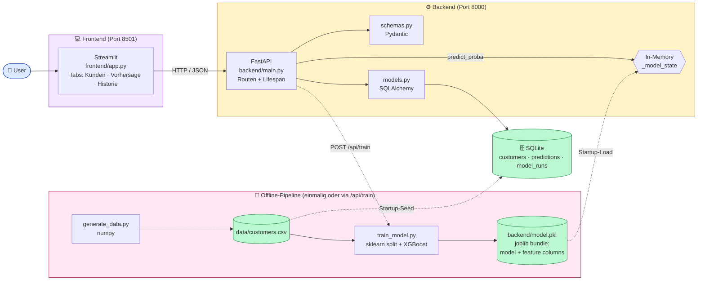
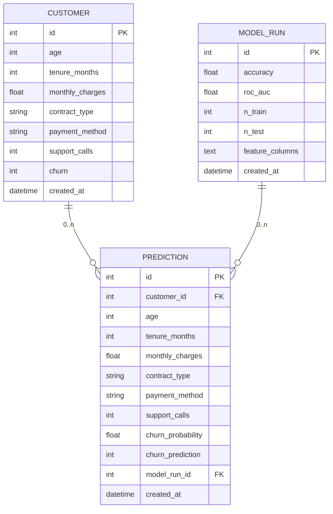
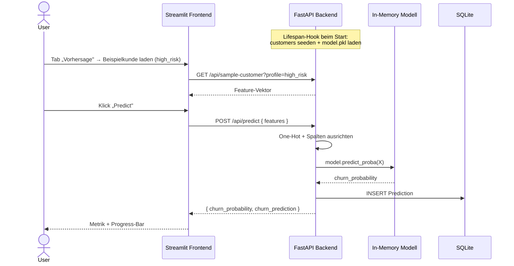

# POC 3 — Churn Prediction (End-to-End ML)

[](https://www.python.org/)
[](https://streamlit.io/)
[](https://fastapi.tiangolo.com/)
[](https://www.sqlalchemy.org/)
[](https://www.sqlite.org/)
[](https://docs.pydantic.dev/)
[](https://scikit-learn.org/)
[](https://xgboost.readthedocs.io/)
[](https://joblib.readthedocs.io/)
[](https://pandas.pydata.org/)
[](https://numpy.org/)
[](#architektur)
[](#)
[](../LICENSE)

> **Komplexitätsstufe 3 — End-to-End ML.** Vollständige ML-Anwendung in vier
> Schichten: **Daten → Training → API → UI**. Synthetische Kunden, ein
> XGBoost-Modell, eine FastAPI-Service-Schicht und ein Streamlit-Frontend mit
> drei Tabs.

Das ist die typische Architektur einer kleinen produktionsnahen ML-App —
auf das absolute Minimum reduziert, damit man sie in einer Sitzung
nachbauen kann.

---

## Was die App kann

- **Datenerzeugung** (`generate_data.py`): synthetisiert ~5 000 Kunden mit
  plausiblen Korrelationen zur Zielvariable `churn` (Churn-Rate ~20 %).
- **Training** (`train_model.py`): One-Hot-Encoding der kategorischen Spalten,
  stratified 80/20-Split, **XGBoost-Klassifikator**, persistiert Modell
  + Feature-Spalten als `backend/model.pkl` (joblib).
- **Backend** (FastAPI + SQLAlchemy + SQLite): seedet Kunden beim Start,
  liefert CRUD-artige Reads, **einzelne und Batch-Vorhersagen**, einen
  Trainings-Trigger und Modell-Metadaten. Speichert jede Vorhersage als
  Audit-Trail.
- **Frontend** (Streamlit, drei Tabs): **Kundenliste mit Filter**,
  **Vorhersage-Formular** (mit Profilen *random / high_risk / low_risk* und
  Auswahl bestehender Kunden), **Historie** der letzten Predictions.

---

## Architektur



**Vier Schichten — kurz:**

1. **Daten:** synthetische CSV (`generate_data.py`).
2. **Modell:** trainiert offline und als `.pkl` persistiert.
3. **Service:** FastAPI lädt das Modell in Memory, beantwortet HTTP-Predicts.
4. **UI:** Streamlit ruft die Service-Schicht und zeigt Tabs.

---

## Datenmodell



### Eine Vorhersage von oben nach unten



---

## API-Endpunkte

| Methode | Pfad                              | Beschreibung                                                                  |
| ------- | --------------------------------- | ----------------------------------------------------------------------------- |
| `GET`   | `/api/health`                     | Liveness-Check, inkl. `model_loaded`-Flag.                                    |
| `GET`   | `/api/customers`                  | Liste der Kunden (`limit`, `offset` als Query-Parameter).                     |
| `GET`   | `/api/customers/{id}`             | Einzelner Kunde.                                                              |
| `GET`   | `/api/sample-customer`            | Beispiel-Feature-Vektor — `profile=random \| high_risk \| low_risk`.          |
| `POST`  | `/api/predict`                    | Vorhersage für einen ad-hoc übergebenen Feature-Vektor.                       |
| `POST`  | `/api/predict/{customer_id}`      | Vorhersage für einen bestehenden Kunden aus der DB.                           |
| `GET`   | `/api/predictions`                | Historie aller Vorhersagen (neueste zuerst).                                  |
| `POST`  | `/api/train`                      | Trigger fürs (Re-)Training des Modells; legt einen `ModelRun`-Eintrag an.     |
| `GET`   | `/api/model/info`                 | Aktuelle Modell-Metadaten (Accuracy, ROC-AUC, Spaltenliste, Trainingsdatum).  |

Interaktive Doku: <http://localhost:8000/docs>

---

## Komponenten-Walk-through

| Datei                                                 | Rolle                                                                                |
| ----------------------------------------------------- | ------------------------------------------------------------------------------------ |
| [`backend/generate_data.py`](backend/generate_data.py) | Erzeugt `data/customers.csv` (~5 000 Zeilen, Churn-Rate ~20 %).                      |
| [`backend/train_model.py`](backend/train_model.py)     | Lädt CSV → One-Hot → 80/20-Split → XGBoost → speichert `model.pkl` (Modell + Spalten). |
| [`backend/main.py`](backend/main.py)                   | FastAPI-App mit `lifespan`-Hook: seedet Kunden, lädt Modell, registriert Routen.     |
| [`backend/models.py`](backend/models.py)               | SQLAlchemy: `Customer`, `Prediction`, `ModelRun`.                                    |
| [`backend/schemas.py`](backend/schemas.py)             | Pydantic: `CustomerOut`, `CustomerFeatures`, `PredictionRequest`, `PredictionOut`, `SampleCustomer`. |
| [`backend/database.py`](backend/database.py)           | Engine, `SessionLocal`, `get_db()`.                                                  |
| [`frontend/app.py`](frontend/app.py)                   | Streamlit-UI: Tabs **Kunden**, **Vorhersage**, **Historie**.                         |

---

## Setup

```bash
cd POC3
python -m venv .venv
source .venv/bin/activate
pip install -r requirements.txt
```

## Starten

```bash
# (optional, läuft beim 1. Backend-Start sonst automatisch)
python backend/generate_data.py

# (optional, kann auch später per POST /api/train ausgelöst werden)
python backend/train_model.py

# Zwei Terminals:
uvicorn backend.main:app --reload          # http://localhost:8000
streamlit run frontend/app.py              # http://localhost:8501
```

Beim ersten Backend-Start passiert (Lifespan-Hook):

1. `data/customers.csv` wird erzeugt, falls sie fehlt.
2. Kunden werden in die SQLite-Tabelle importiert (falls leer).
3. `backend/model.pkl` wird in Memory geladen, falls vorhanden.

> Wenn das Modell noch nicht trainiert wurde, antwortet `/api/predict` mit
> **HTTP 503**. Lösung: einmal `POST /api/train` aufrufen oder vor dem Start
> `python backend/train_model.py` ausführen.

---

## Testplan & erwartetes Verhalten

| Schritt | Aktion                                                              | Erwartetes Verhalten                                                                                          |
| ------- | ------------------------------------------------------------------- | ------------------------------------------------------------------------------------------------------------- |
| 1       | Backend starten                                                     | Logs: *„Imported N customers …"* und *„Loaded model from …"* (falls vorab trainiert).                         |
| 2       | `curl http://localhost:8000/api/health`                             | `{"status":"ok","model_loaded":true}`                                                                          |
| 3       | Frontend öffnen                                                     | Drei Tabs sichtbar: **Kunden · Vorhersage · Historie**.                                                       |
| 4       | Tab **Kunden**                                                      | Tabelle mit Kunden, Filter nach `contract_type` funktioniert.                                                 |
| 5       | Tab **Vorhersage** → **Beispielkunde laden** mit `profile=high_risk` | Formular wird mit Hochrisiko-Werten befüllt.                                                                  |
| 6       | **Predict** klicken                                                 | Metriken **Churn-Wahrscheinlichkeit** (z. B. > 70 %) und **Vorhersage = Churn** mit Progress-Bar.             |
| 7       | „Vorhandenen Kunden wählen" → **Vorhersage für gewählten Kunden**   | Liefert `PredictionOut` mit `customer_id`, gespeichert in `predictions`-Tabelle.                              |
| 8       | Tab **Historie**                                                    | Liste der letzten Predictions (neueste zuerst).                                                               |
| 9       | `POST /api/train` aufrufen                                          | Antwortet mit `accuracy` und `roc_auc` (typ. ~0.85 / ~0.90 für diesen Datensatz). Neuer `ModelRun`-Eintrag.    |

---

## 📋 Der exakte Copilot-Prompt

> Im Copilot Agent Mode in einen leeren Ordner pasten — die vier Blöcke
> nacheinander.

### 1. Daten-Generator

```text
Erstelle backend/generate_data.py: erzeugt mit numpy einen realistischen
synthetischen Churn-Datensatz mit ca. 5000 Zeilen
(Felder: id, age, tenure_months, monthly_charges, contract_type,
payment_method, support_calls, churn) und speichert ihn als
data/customers.csv. Churn-Rate ca. 20 %, Features sollen plausibel mit
churn korrelieren.
```

### 2. Modelltraining

```text
Erstelle backend/train_model.py: ruft generate_data.py auf, falls
data/customers.csv fehlt; liest die CSV, One-Hot-kodiert contract_type
und payment_method, trainiert einen xgboost.XGBClassifier (stratifizierter
80/20-Split), gibt Accuracy und ROC-AUC aus und speichert Modell +
Spaltenliste nach backend/model.pkl (joblib).
```

### 3. Backend (FastAPI)

```text
Erstelle backend/main.py mit FastAPI: Modelle Customer, Prediction,
ModelRun (SQLAlchemy). Endpunkte: GET /api/customers,
GET /api/customers/{id}, POST /api/predict,
POST /api/predict/{customer_id}, POST /api/train, GET /api/model/info,
GET /api/predictions.

Bei App-Start: wenn customers-Tabelle leer ist, Daten aus
data/customers.csv importieren (und generate_data.py ausführen, falls
die Datei fehlt) — so sind sofort Beispielkunden abrufbar, ohne dass
irgendetwas hochgeladen wurde.

Zusätzlicher Endpunkt GET /api/sample-customer: liefert einen zufälligen
Beispiel-Feature-Vektor (z. B. einen echten Kunden oder typische
"high-risk"/"low-risk"-Profile) — damit das Frontend die Prediction testen
kann.

CORS für http://localhost:8501. Pydantic-Schemas nutzen.
```

### 4. Frontend (Streamlit)

```text
Erstelle frontend/app.py (Streamlit) mit drei Tabs:

Tab "Kunden": Tabelle aus /api/customers mit Filter nach contract_type.

Tab "Vorhersage": Formular mit allen Features (sinnvolle Defaults) plus
Button "Beispielkunde laden" (ruft GET /api/sample-customer und befüllt
das Formular) sowie Selectbox "Vorhandenen Kunden wählen" (nutzt
POST /api/predict/{id}). Button "Predict" ruft /api/predict und zeigt
Wahrscheinlichkeit als Metrik und Progress-Bar.

Tab "Historie": zeigt /api/predictions.
```

---

## Extension Ideas

- 📈 **Feature-Importance** im Frontend anzeigen (XGBoost `feature_importances_`).
- 🤖 **Modell-Vergleich**: zwei Modelle (z. B. LogisticRegression vs. XGBoost)
  parallel trainieren und im UI zur Auswahl stellen.
- 🧮 **Batch-Predict**: CSV hochladen → Vorhersagen für alle Zeilen.
- 🪪 **Auth**: API-Key-Header für `/api/predict` und `/api/train`.
- 🧊 **Background-Training** mit `BackgroundTasks` (Frontend pollt Status).
- 🔍 **Erklärbarkeit**: SHAP-Werte für eine einzelne Vorhersage berechnen
  und als Wasserfall-Plot zeigen.
- 📊 **Drift-Monitoring**: Verteilung neuer Predictions mit Trainings-Verteilung
  vergleichen.

---

## Projektstruktur

```text
POC3/
├── README.md                       ← ihr seid hier
├── requirements.txt
│
├── backend/
│   ├── __init__.py
│   ├── main.py                     ← FastAPI + Lifespan
│   ├── models.py                   ← SQLAlchemy: Customer, Prediction, ModelRun
│   ├── schemas.py                  ← Pydantic
│   ├── database.py
│   ├── generate_data.py            ← synthetischer Churn-Datensatz
│   ├── train_model.py              ← Training + joblib-Persistenz
│   └── (model.pkl)                 ← entsteht beim Training (gitignored)
│
├── frontend/
│   └── app.py                      ← Streamlit, drei Tabs
│
└── data/
    └── customers.csv               ← entsteht beim 1. Start
```
