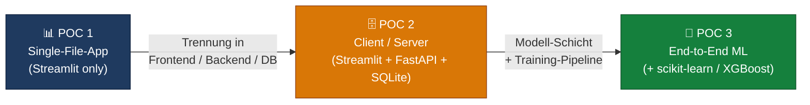
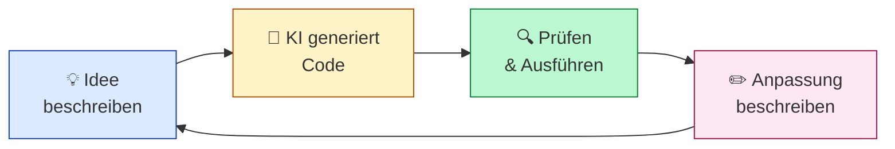

# POCs mit VS Code & GitHub Copilot Agent Mode

[](https://www.python.org/)
[](https://streamlit.io/)
[](https://fastapi.tiangolo.com/)
[](https://www.sqlalchemy.org/)
[](https://www.sqlite.org/)
[](https://scikit-learn.org/)
[](https://xgboost.readthedocs.io/)
[](https://pandas.pydata.org/)
[](https://docs.github.com/copilot)
[](https://code.visualstudio.com/)
[](#)
[](LICENSE)

Drei kleine, in sich geschlossene Prototypen, die euch durch **drei Komplexitätsstufen
moderner Daten-Apps** führen — von der Single-File-Streamlit-App über eine
saubere Drei-Schichten-Architektur bis hin zu einer end-to-end ML-Anwendung.

Begleitmaterial zur Veranstaltung *„POCs mit VS Code und GitHub Copilot"* von
**Prof. Dr. Christoph Weisser**.

> **Pädagogisches Ziel.** Jede POC wurde end-to-end durch einen einzigen,
> sauber strukturierten Prompt im **Copilot Agent Mode** erzeugt. Der exakte
> Prompt liegt in der jeweiligen POC-README, sodass ihr das Experiment
> reproduzieren, abändern und erweitern könnt.

---

## Die drei Komplexitätsstufen

| #   | Ordner                | Stufe                            | Was ihr lernt                                                                | Stack                                                                |
| --- | --------------------- | -------------------------------- | ---------------------------------------------------------------------------- | -------------------------------------------------------------------- |
| 1   | [`POC1/`](POC1/)      | **Single-File-App**              | Eine vollständige Datenanalyse-UI in einer Datei, kein Backend.              | Streamlit · pandas · matplotlib                                      |
| 2   | [`POC2/`](POC2/)      | **Client / Server**              | Frontend trennt sich vom Backend, Daten werden persistent gespeichert.       | Streamlit · FastAPI · SQLAlchemy · SQLite                            |
| 3   | [`POC3/`](POC3/)      | **End-to-End ML**                | Daten → Training → API → UI: die typische ML-Anwendung in vier Schichten.    | Streamlit · FastAPI · SQLAlchemy · scikit-learn / XGBoost · joblib   |

Jede POC enthält in ihrer README:

- den **exakten Copilot-Prompt**, mit dem sie erzeugt wurde,
- ein **Architektur-Diagramm** (Mermaid),
- einen **komponentenweisen Walk-through**,
- **Setup & Start**,
- einen **Schritt-für-Schritt-Testplan** mit erwarteten Outputs,
- **Extension Ideas** zum Weiterbauen.

---

## Architektur-Vergleich der drei POCs



> **Hinweis zur Anzeige:** GitHub rendert Mermaid nativ. In VS Code braucht ihr
> die Extension *„Markdown Preview Mermaid Support"* (`bierner.markdown-mermaid`),
> sonst wird der Diagramm-Block nur als Code angezeigt.

---

## Wie ihr dieses Repo nutzt

### Pfad A — Einfach durchklicken (≈ 20 min)

Wenn ihr die drei Muster nur einmal *laufen sehen* wollt, folgt den READMEs in
Reihenfolge:

1. [POC1/README.md](POC1/README.md) — CSV-Explorer in einer Datei
2. [POC2/README.md](POC2/README.md) — Frontend ↔ Backend ↔ Datenbank
3. [POC3/README.md](POC3/README.md) — ML-Modell hinter einer API mit UI

### Pfad B — Mit Copilot Agent Mode reproduzieren (≈ 1 h)

So sind die POCs *gemeint*:

1. VS Code in einem **leeren Ordner** öffnen.
2. Copilot Chat öffnen, Modus von **Ask** auf **Agent** umstellen.
3. Die jeweilige POC-README öffnen und den Block aus *„📋 Der exakte Copilot-Prompt"*
   in den Chat kopieren.
4. Den Agent generieren lassen — ggf. iterieren.
5. Eure Version mit der hier eingecheckten vergleichen, um zu sehen, welche
   Designentscheidungen ein LLM-Agent treffen kann.

### Pfad C — Erweitern (offen)

Jede POC endet mit *„Extension Ideas"* — konkrete nächste Schritte, um euer
Verständnis zu vertiefen (z. B. POC2 um Auth ergänzen, POC3 um ein zweites
Modell, POC1 um interaktive Plots mit Plotly).

---

## Voraussetzungen

| Was               | Warum                                                                              |
| ----------------- | ---------------------------------------------------------------------------------- |
| Python 3.10+      | Alle POCs nutzen moderne Type-Hints (`list[str]`, `Mapped[...]`, `match`).         |
| ~500 MB freier Speicher | Für SQLite-DBs, Uploads, Plot-PNGs und das XGBoost-Modell-Artefakt.          |
| VS Code + Copilot | Nur für **Pfad B** nötig (Reproduktion via Agent Mode).                            |
| (optional) Git    | Empfohlen — siehe Workflow-Abschnitt unten.                                        |

---

## Quick Start

```bash
git clone https://github.com/<your-org>/POCs-mit-VS-Code-und-GitHub-Copilot.git
cd POCs-mit-VS-Code-und-GitHub-Copilot

# POC auswählen
cd POC1   # oder POC2 / POC3

# Eigenes venv pro POC (empfohlen)
python -m venv .venv
source .venv/bin/activate
pip install -r requirements.txt
```

Die genauen Run-Befehle stehen in jeder POC-README. Faustregel:

```bash
# POC1
streamlit run app.py

# POC2 / POC3 (zwei Terminals)
uvicorn backend.main:app --reload          # http://localhost:8000
streamlit run frontend/app.py              # http://localhost:8501
```

---

## Repository-Layout

```text
POCs-mit-VS-Code-und-GitHub-Copilot/
├── README.md                       ← ihr seid hier
│
├── POC1/                           ← Stufe 1: Single-File-Streamlit
│   ├── README.md                   ← Walk-through, Prompt, Testplan
│   ├── app.py                      ← komplette App in einer Datei
│   ├── sample_data.py
│   ├── data/sample.csv
│   └── requirements.txt
│
├── POC2/                           ← Stufe 2: Frontend + Backend + DB
│   ├── README.md
│   ├── backend/                    ← FastAPI + SQLAlchemy + SQLite
│   │   ├── main.py
│   │   ├── models.py · schemas.py · database.py · analysis.py
│   │   └── sample_data.py
│   ├── frontend/app.py             ← Streamlit, ruft Backend per HTTP
│   ├── data/uploads/ · data/plots/
│   └── requirements.txt
│
└── POC3/                           ← Stufe 3: End-to-End ML
    ├── README.md
    ├── backend/                    ← FastAPI + SQLAlchemy + Modell
    │   ├── main.py
    │   ├── models.py · schemas.py · database.py
    │   ├── generate_data.py        ← synthetischer Churn-Datensatz
    │   └── train_model.py          ← trainiert + speichert model.pkl
    ├── frontend/app.py             ← Streamlit mit drei Tabs
    ├── data/customers.csv
    └── (backend/model.pkl)         ← entsteht beim Training
```

---

# Lehrkontext: Vibe Coding mit GitHub Copilot Agent Mode

Die drei POCs sind als Begleitmaterial zur Veranstaltung *„POCs mit VS Code
und GitHub Copilot"* entstanden. Sie wurden
end-to-end im **Agent Mode** von GitHub Copilot gebaut.

## Lernziele

Nach dem Durcharbeiten der drei POCs könnt ihr …

- mit GitHub Copilot Agent Mode autonom kleine Apps bauen,
- Streamlit-Apps für Datenanalyse selbstständig erstellen,
- eine Drei-Schichten-Architektur (Streamlit + FastAPI + SQLite) verstehen
  *und* umsetzen,
- eine ML-Anwendung end-to-end bauen: Daten → Modell → API → UI,
- KI-generierten Code lesen, prüfen und gezielt verbessern,
- einen sauberen Git-/GitHub-Workflow für POCs fahren.

**Bewusst nicht im Fokus:** Unit-Tests, CI/CD, Production-Deployment,
ML-Theorie, Frontend-Frameworks (React/Vue/…), Docker/Kubernetes.

## Was ist ein POC?

- Ein **lauffähiger Prototyp**, der eine konkrete Idee belegt.
- Klein, fokussiert, in *Stunden bis Tagen* baubar.
- Optimiert auf **Lerngeschwindigkeit**, nicht auf Robustheit.
- Bewusst weggelassen: Tests, Auth, Multi-User, Caching, Background-Jobs,
  Production-Deployment, optisches Polish.

> **Faustregel:** Lieber drei Dinge belegen als ein Ding perfektionieren.

## Der Vibe-Coding-Zyklus



Jede Iteration dauert Sekunden bis Minuten — das ist der Unterschied zum
klassischen Coding-Loop.

## Agent Mode vs. Ask Mode

| Eigenschaft                        | Ask Mode      | Agent Mode |
| ---------------------------------- | :-----------: | :--------: |
| Code-Vorschläge                    | ✓             | ✓          |
| Fragen beantworten                 | ✓             | ✓          |
| Dateien erstellen / bearbeiten     | ✗             | ✓          |
| Terminal-Befehle ausführen         | ✗             | ✓          |
| Mehrstufige Aufgaben               | ✗             | ✓          |
| Selbstständig Fehler beheben       | ✗             | ✓          |
| Kontext: ganzes Projekt            | eingeschränkt | ✓          |

**Faustregel:** Ask für Fragen, Agent für Aufgaben.

## Prompt-Engineering für Code

Anatomie eines guten Code-Prompts — fünf Bausteine:

1. **Stack explizit nennen** — z. B. „FastAPI + SQLAlchemy + SQLite".
2. **Dateien & Ordner vorgeben** — `backend/main.py`, `frontend/app.py`.
3. **Datenmodell & Endpunkte konkret** — Tabellen mit Spalten, REST-Routen
   mit Methoden.
4. **Demo-Daten einfordern** — `sample_data.py`, `/api/sample`.
5. **Randbedingungen** — CORS, Ports, Pydantic, erlaubte Bibliotheken.

> Schlechte Prompts produzieren *generischen* Code. Gute Prompts produzieren
> *euren* Code.

Die vollständigen Prompts der drei POCs findet ihr in der jeweiligen
POC-README (Abschnitt *„📋 Der exakte Copilot-Prompt"*).

## Git/GitHub-Workflow: GitHub zuerst

1. **GitHub-Repo** online anlegen (mit `README`, `.gitignore`, Lizenz).
2. **Lokal klonen** (`git clone`).
3. **VS Code** öffnen.
4. **Dateien** anlegen.
5. **Commit & Push** — regelmäßig nach jeder funktionierenden Änderung.

> **Goldene Regel:** Nach jeder funktionierenden Änderung committen.

### `.gitignore` — was *nicht* ins Repo gehört

```gitignore
.venv/
__pycache__/
*.db
*.pkl
.env
*.key
```

## Fallstricke & Sicherheit

1. **Geheimnisse im Repo** — `.env`, API-Keys gepusht → *sofort rotieren*.
2. **Fehlende `.gitignore`** — `.venv/`, `__pycache__/`, `*.db` fehlen.
3. **Falsche Python-Umgebung** — Conda vs. venv vs. System-Python.
4. **Port-Konflikte** — 8000 / 8501 bereits belegt.
5. **CORS-Fehler** — Streamlit (8501) ruft FastAPI (8000), Header fehlt.
6. **Riesige Commits** ohne Botschaft — nichts mehr nachvollziehbar.

> **Niemals ins Repo:** API-Keys, Tokens, Passwörter, `.env`-Dateien mit
> echten Werten, Datenbanken mit personenbezogenen Daten. Wenn doch
> passiert: Schlüssel sofort rotieren — Löschen aus Git reicht *nicht*.

---

## Take-aways

1. **POC = Lerngeschwindigkeit > Robustheit.** Drei kleine Apps schlagen
   ein perfektes Projekt.
2. **Vibe Coding ist ein Loop.** Sekunden pro Iteration, nicht Stunden.
3. **Prompt-Qualität = Code-Qualität.** Stack, Dateien, Schemas, Demo-Pfad
   in jeden Prompt.
4. **KI-Code immer lesen, ausführen, gegen Halluzinationen prüfen.**
5. **Architektur ist „wer ruft wen wie auf"** — nicht der Use Case.
6. **ML-App = Drei-Schichten + Modell-Schicht.** Mehr braucht's selten.
7. **Secrets niemals in Git.** `.gitignore` vor dem ersten Commit.

## Ressourcen

- Streamlit: <https://docs.streamlit.io>
- FastAPI: <https://fastapi.tiangolo.com>
- SQLAlchemy: <https://docs.sqlalchemy.org>
- XGBoost: <https://xgboost.readthedocs.io>
- GitHub Copilot: <https://docs.github.com/copilot>
- Git (deutsch): <https://git-scm.com/book/de>
